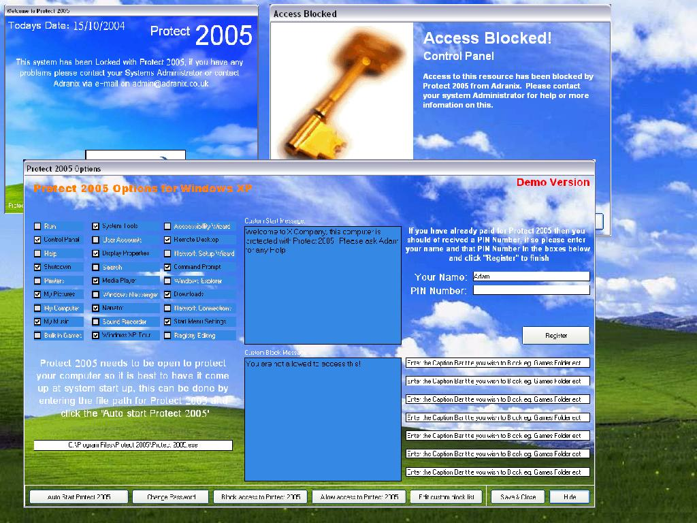



## Protect 2005

### Description

With Protect 2005 you can block access to many parts of Windows with a password, for example if you tick the control panel box only you can access control panel with your password also Protect 2005 can come up at startup and have custom messages for when a program ect. is blocked. It has a 20 uses free trial on it, the first run code is 0101 and the registration code is 0040-0110.

I am only 14 and this has taken a long time to make so Please leave comments and Please Vote.

Thanks, Adam
 
### More Info
 

             |
---                |---
**Submitted On**   |2004-10-17 19:16:34
**By**             |[Adam Ranshaw](https://github.com/Planet-Source-Code/PSCIndex/blob/master/ByAuthor/adam-ranshaw.md)
**Level**          |Intermediate
**User Rating**    |4.0 (32 globes from 8 users)
**Compatibility**  |VB 5\.0, VB 6\.0
**Category**       |[Registry](https://github.com/Planet-Source-Code/PSCIndex/blob/master/ByCategory/registry__1-36.md)
**World**          |[Visual Basic](https://github.com/Planet-Source-Code/PSCIndex/blob/master/ByWorld/visual-basic.md)
**Archive File**   |[Protect\_2018077910192004\.zip](https://github.com/Planet-Source-Code/adam-ranshaw-protect-2005__1-56822/archive/master.zip)

